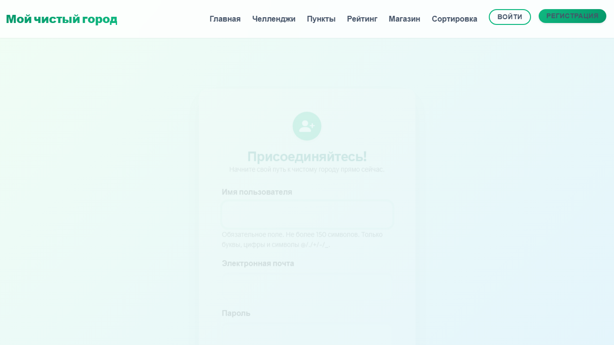
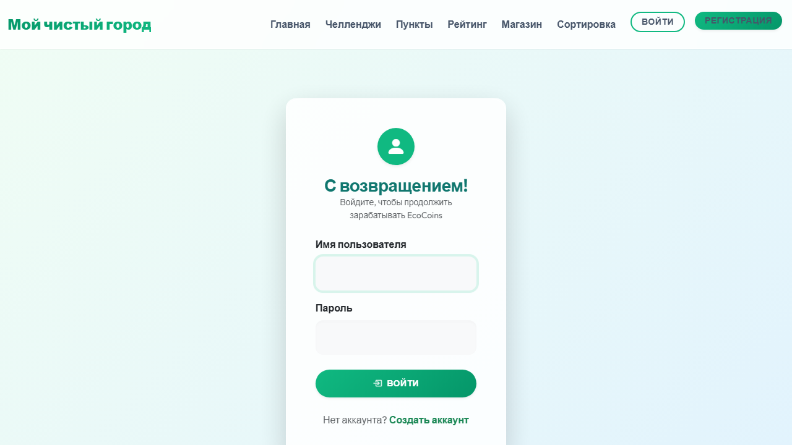
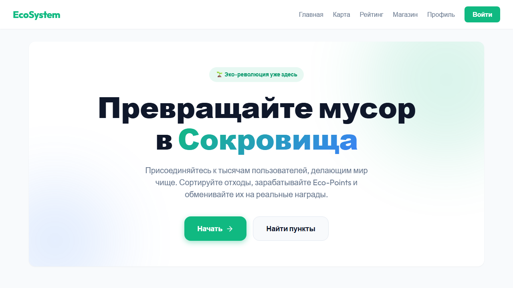
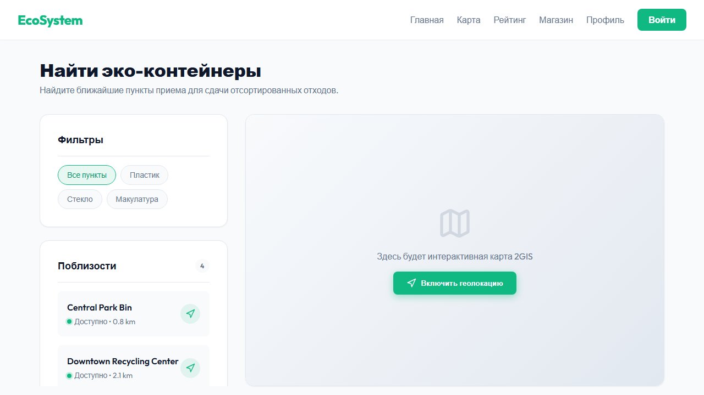

# ECO-SYSTEM

## Description
This project is a web application for an eco-awareness platform. It helps manage and track environmental activities, provides information on waste sorting, and offers an interactive map of recycling points.

## Features
- User registration
- Login system
- Eco-challenges tracking and progress management
- Interactive recycling points map (integrated with 2GIS)
- Gamified rewards system and admin panel

## Tech Stack
- Python (Django)
- SQLite (for development)
- HTML, CSS, JavaScript (Bootstrap 5, 2GIS Map API)

## Installation

```bash
# Clone the repository
git clone https://github.com/yourusername/ECO-SYSTEM.git
cd ECO-SYSTEM

# Create and activate virtual environment
python -m venv .venv
.\.venv\Scripts\activate

# Install dependencies
pip install -r requirements.txt

# Apply migrations
python manage.py migrate

# (Optional) Load initial data
python manage.py loaddata fixtures/initial_data.json

# Run the development server
python manage.py runserver
```

---

# ИНСТРУКЦИЯ ПОЛЬЗОВАТЕЛЯ

## 1. Введение
Данная система («Платформа экопросвещения ECO-SYSTEM») предназначена для вовлечения граждан в экологические инициативы. Целевая аудитория — люди, интересующиеся экологией, волонтеры, а также все желающие начать сортировать отходы и участвовать в экологических челленджах. Система позволяет отслеживать свой прогресс и находить ближайшие пункты приема вторсырья.

## 2. Требования
- **Устройство:** Персональный компьютер, ноутбук, планшет или смартфон.
- **Браузер:** Любой современный веб-браузер (Google Chrome, Firefox, Safari, Edge, Яндекс Браузер) с поддержкой JavaScript.
- **Условия работы:** Стабильное подключение к сети Интернет.

## 3. Установка и запуск
Шаги запуска проекта описаны в разделе **Installation** выше.
Для локального запуска убедитесь, что у вас установлен Python (версии 3.8 или выше). Выполните миграции базы данных и запустите локальный сервер командой `python manage.py runserver`. После запуска перейдите в браузере по адресу `http://127.0.0.1:8000/`.

## 4. Основные функции

### 4.1 Регистрация
Для начала работы необходимо создать аккаунт. Перейдите на страницу регистрации, введите имя пользователя, электронную почту и надежный пароль, затем нажмите кнопку "Зарегистрироваться".


### 4.2 Авторизация
После регистрации воспользуйтесь страницей входа (Login). Введите свои учетные данные (имя пользователя и пароль) и нажмите "Войти".


### 4.3 Основной функционал
Проект предоставляет интерактивную карту для поиска пунктов приема вторсырья, список экологических челленджей за которые можно получать баллы, а также магазин наград.
- **Карта:** используйте фильтры на карте для поиска пунктов приема нужного типа отходов.
- **Челленджи и Ресурсы:** отмечайте выполнение задач, пользуйтесь правилами из раздела «Как сортировать» и повышайте свой уровень.


## 5. Работа с системой (пошагово)
- **Шаг 1:** Откройте главную страницу сайта. Зарегистрируйтесь (или войдите в существующий аккаунт) в разделе профиля.
- **Шаг 2:** Перейдите в раздел "Челленджи" (Challenges), выберите интересующее экологическое задание и начните его выполнение.
- **Шаг 3:** Перейдите в раздел "Карта" (Locations), чтобы найти ближайший к вам пункт приема перерабатываемых отходов с помощью интерактивной карты.
- **Шаг 4:** В профиле отслеживайте свой прогресс и обменивайте накопленные эко-баллы на бонусы в разделе "Награды".


## 6. Частые ошибки

- **Ошибка:** Сервер не запускается, выводится ошибка `ImportError: Couldn't import Django`.
  - **Решение:** Убедитесь, что вы активировали виртуальное окружение (`.\.venv\Scripts\activate`) и установили все зависимости проекта (`pip install -r requirements.txt`).
- **Ошибка:** Не отображается интерактивная карта локаций.
  - **Решение:** Проверьте подключение к Интернету (карта загружается через внешние API 2GIS) и убедитесь, что в браузере не заблокированы скрипты сторонними расширениями (например, AdBlock).
- **Ошибка:** При открытии карты или челленджей ничего нет.
  - **Решение:** База данных пуста. Выполните команду `python manage.py loaddata fixtures/initial_data.json` в терминале для загрузки тестовых данных.

## 7. Заключение
ECO-SYSTEM — это мощный инструмент для развития экологического сознания и реального вклада в защиту окружающей среды. Регулярно участвуя в челленджах и правильно сортируя отходы, каждый пользователь делает мир чище! Использование платформы интуитивно понятно и не требует специальных навыков.